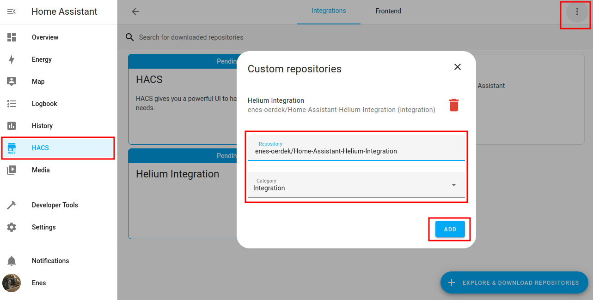
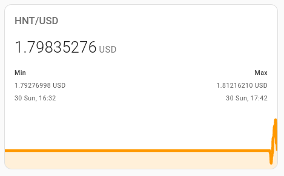
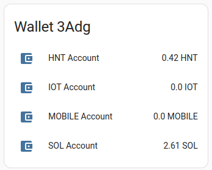

# Helium Integration for Home Assistant
[](https://github.com/hacs/integration)
## Introduction

Welcome to the future of Home Assistant integration with Helium! :tada: This project is designed to bring the power and versatility of Helium to your smart home, revolutionizing the way you interact with your connected devices. We've taken a fresh approach, building a comprehensive integration from the ground up to support the latest post-migration features of Helium. :rocket:

By embracing not only the HNT state but also the subDAOs IOT and MOBILE, the integration unlocks new possibilities for seamless connectivity across your smart home ecosystem. :bulb: Moreover, the solution incorporates the new staking system, ensuring that you stay ahead of the curve in the rapidly evolving world of decentralized networks. :globe_with_meridians:

Join us on this exciting journey as we redefine the way you interact with Home Assistant and Helium, and let's create a more connected and decentralized future together! :sparkles:

## Roadmap :rocket: 

- [x] **Price of HNT, IOT, and MOBILE** - Stay informed with real-time price updates for HNT, IOT, and MOBILE tokens, empowering you to make smarter decisions and optimize your smart home experience! :moneybag:
- [x] **General Helium Stats** - Get a comprehensive overview of the Helium network with key performance metrics and insights, ensuring you always have your finger on the pulse of this dynamic ecosystem! :mag:
- [x] **Wallet Stats** - Track your wallet balances and transactions with ease, helping you manage your assets and stay in control of your financial well-being! :chart_with_upwards_trend:
- [ ] **Hotspot Stats** - Monitor your Helium hotspot performance, so you can maximize your earnings and contribute to a robust decentralized network! :satellite:
- [x] **Hotspot Rewards** - Keep track of your Helium hotspot rewards, including detailed reward breakdowns, to stay informed about your earnings and celebrate your successes! :trophy:
- [ ] **Staking Stats** - Stay up to date with your staking positions, providing you with valuable information to help you navigate the exciting world of Helium staking! :lock:
- [ ] **Staking Rewards** - Keep tabs on your staking rewards, enabling you to make the most of your investments and celebrate your wins in the Helium ecosystem! :tada:
- [ ] **Device Integration** - Seamlessly integrate devices from a Helium Console and jumpstart your IoT projects with ease. Experience the power of Helium in every device and transform your smart home experience! :electric_plug:
- [ ] **Blueprints for Easy Automation** - [Blueprints](https://www.home-assistant.io/docs/blueprint/tutorial/) allow rapid configuration of automations without diving too much into code, making it easier than ever to automate your smart home! :wrench:
- [ ] **Conf-Flow (Optional)** - With conf-flow, you can configure your Helium integration completely from the UI without updating your `configuration.yaml`, making setup even more user-friendly! :gear:


## Installation :hammer_and_wrench:

Follow these simple steps to get started.

1. **Install the Home Assistant Community Store (HACS)** - Before you can use this integration, you'll need to have [HACS](https://github.com/hacs/integration) installed. Haven't set it up yet? No worries! Check out the [HACS installation guide](https://hacs.xyz/docs/installation/installation) to get up and running in no time.

2. **Add Custom Repository** - As our plugin is still maturing and not yet available in the HACS store, you'll need to install it as a custom repository. Don't worry; it's a breeze! Simply follow these steps:

    - Navigate to HACS in your Home Assistant instance
    - Select "Integrations"
    - Click the three dots in the top right corner and choose "Custom repositories"
    - In the "Add custom repository" dialog, enter the following information:
        - Repository: `enes-oerdek/Home-Assistant-Helium-Integration`
        - Category: `Integration`
    - Click "Add" and you're good to go!



Now you're all set to enjoy the benefits of Helium integration in your Home Assistant! :tada:


## Configuration :gear:

Get ready to unlock the full potential of Helium integration in your Home Assistant with this simple configuration! :star:

1. **Update your `configuration.yaml`** - Add the following code snippet to your `configuration.yaml` file:
```yaml
sensor:
  - platform: helium_solana
```

This one-liner will introduce new sensors for the prices of HNT, IOT, MOBILE, and SOL, providing you with valuable insights right at your fingertips! :gem:

*Optional*: If you are interested in your wallet stats as well, you need to add the "wallets" part in your configuration as well.

```yaml
sensor:
  - platform: helium_solana
    wallets:
    - SOLANA WALLET ADDRESS HERE
```
Replace "SOLANA WALLET ADDRESS HERE" with your Solana Wallet Address. You can find this address in the settings of the black Helium App > Copy Address > Solana. Your resulting configuraiton might look like this:
```yaml
sensor:
  - platform: helium_solana
    wallets:
    - rAwOnpD26GH8FcEo1H4ng3MPPsN8C5KdZ7N7MqAS
```


3. **Customize your dashboard** - Now that your sensors are set up, it's time to add them to your Home Assistant dashboard. Check out the examples below for inspiration and create a personalized display that suits your needs.

4. **Introduce Automations** - Stay ahead of the game by setting up automations to be notified of major price changes! :mega: Create an automation using the newly introduced price data, so you're always in the know when it comes to your investments.

Your Home Assistant is now supercharged with Helium integration, giving you unparalleled control and insights into your smart home ecosystem! :tada:
This will introduce new sensors with the prices of HNT, IOT, MOBILE and SOL. You can now add these sensors into your dashboard (see examples).

## Examples :rainbow:

Discover the amazing possibilities of Helium integration in your Home Assistant through these inspiring examples! :star: These examples are very simple demonstrations on how the Helium integration entities can be used. Better examples will be added during upcoming updates, so stay tuned for more!

### Price Monitoring :bar_chart:

Enhance your dashboard with sleek and informative price monitoring graphs using the [mini-graph-card](https://github.com/kalkih/mini-graph-card). Visualize price trends and make data-driven decisions with style!

**Preview:**



Or with multiple cards:


**Code:**

```yaml
animate: true
entities:
  - entity: sensor.price_hnt
graph: line
hour24: true
font_size: 75
hours_to_show: 72
points_per_hour: 12
name: HNT/USD
decimals: 8
show:
  extrema: true
  icon: false
  name: true
type: custom:mini-graph-card
```

### Network Monitoring :bar_chart:

Keep a close eye on the Helium network's Key Performance Indicators, and make well-informed decisions with essential data at your fingertips.

**Preview:**


**Code:**

```yaml
type: entities
entities:
  - entity: sensor.helium_stats_iot_active_hotspots
    name: Active Hotspots
  - entity: sensor.helium_stats_iot_total_hotspots
    name: Total Hotspots
  - entity: sensor.helium_stats_iot_total_cities
    name: Total Cities
  - entity: sensor.helium_stats_iot_total_countries
    name: Total Countries
  - entity: sensor.helium_stats_iot_daily_average_rewards
    name: Daily Average Rewards
title: Helium IOT

```

### Wallet Balance :money_with_wings:

Effortlessly keep track of your wallet balance and stay informed about your assets in the Helium ecosystem.

**Preview:**



**Code:**

Each wallet has a unique entity ID. You need to add your identifier for your wallet. It is the first 4 chars of your solana address. Replace [YOUR ID HERE] (including brackets) with your wallet id.

```yaml
type: entities
entities:
  - entity: sensor.helium_wallet_[YOUR ID HERE]_hnt_balance
    name: HNT Account
  - entity: sensor.helium_wallet_[YOUR ID HERE]_iot_balance
    name: IOT Account
  - entity: sensor.helium_wallet_[YOUR ID HERE]_mobile_balance
    name: MOBILE Account
  - entity: sensor.helium_wallet_[YOUR ID HERE]_sol_balance
    name: SOL Account
title: Wallet [YOUR ID HERE]
```

## Contributing :handshake:

We warmly welcome contributions from the community! Whether you have a brilliant idea, a bug report, or simply want to lend a helping hand, your input is greatly appreciated. :star:

To get started, you can:

1. **Submit an issue** - Found a bug or have a feature request? Open a new issue on our GitHub repository and let us know.
2. **Create a pull request** - Have a fix or improvement you'd like to contribute? Fork the repo, make your changes, and submit a pull request for review.

Together, we can make this project even better! :muscle:


## Acknowledgements :raised_hands:

A big thank you to the following contributors for their invaluable resources and support that helped make this project possible:

1. [Aaron Godfrey](https://aarongodfrey.dev/home%20automation/building_a_home_assistant_custom_component_part_1/) - For providing a comprehensive guide on creating a HACS integration.

2. [lthiery](https://github.com/lthiery/hnt-explorer) - For providing the new hnt-explorer which makes consuming staking data easier.

3. [rsnodgrass' hass-helium](https://github.com/rsnodgrass/hass-helium) - Before creating a new integration, I used rsnodgrass' plugin and I liked it. Unfortunately it does not seem to get updated. 

3. [Hotspotty](https://hotspotty.net) - For Network Stats the public API of hotspotty is used. 

Stay tuned for more acknowledgements as our project evolves and grows! :rocket:
